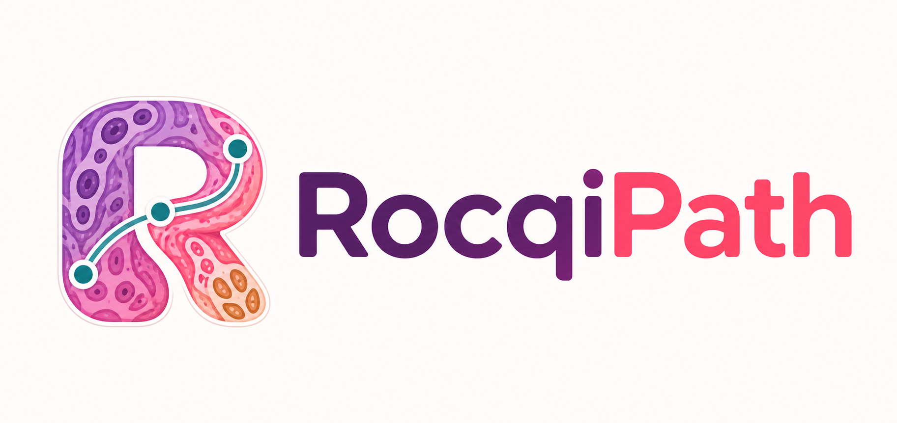

# RocqiPath

Personal tools for common pathology image-analysis jobs:

- align H&E and IHC whole-slide images;
- extract tissue regions, TMA cores, and paired patches;
- normalize stains;
- count DAB-positive cells; and
- make QC and comparison figures.

The repository is intentionally a collection of direct feature pipelines. It does not
manage datasets, experiments, recipes, stages, or training plans.

## Install

RocqiPath supports 64-bit Python 3.10 and 3.11.

```console
git clone https://github.com/DarshilGajjar/RocqiPath.git
cd RocqiPath
python -m pip install -e ".[extraction,orb,stain,cellcount,viz]"
```

Use the `valis` extra instead of `orb` when non-rigid VALIS registration is needed.
Add the `semantic` extra to use TIAToolbox tissue segmentation:

```console
python -m pip install -e ".[extraction,semantic]"
rocqipath extract /path/to/slides /path/to/output --detector semantic
```

Omitting `--detector semantic` keeps the existing Otsu-based extraction behavior.
Slide reading also requires OpenSlide; registration and pyramidal TIFF output require
libvips.

## Use

The CLI maps directly to the five feature workflows:

```console
rocqipath align --help
rocqipath extract --help
rocqipath stain --help
rocqipath count --help
rocqipath compare --help
```

Python usage is equally direct:

```python
from rocqipath.extraction import TissueExtractionConfig, run_tissue_pipeline

config = TissueExtractionConfig(target_magnification=20.0)
run_tissue_pipeline("/path/to/slides", "/path/to/output", config)
```

The [`how_to_use`](how_to_use/README.md) notebooks cover installation, slide inspection,
extraction, alignment, patch reconstruction, stain normalization, cell counting,
visualization, and an end-to-end H&E/CD8 workflow.

The local browser workspace is being developed in `studio-web`. See
[Using RocqiPath Studio](how_to_use/09_Studio_Web.md) for its current status,
setup, API usage, workflow inputs, results, and troubleshooting.

## Development

Use Python 3.10 or 3.11 in a virtual environment, then run:

```console
python -m pip install -e ".[test]"
python -m pytest
ruff check src tests
```

CI runs these checks on both supported Python versions, after checking the
dependency-free package import and CLI help. The default suite uses synthetic
images and does not download models or require scanner files. Tests requiring
TIAToolbox or libvips report skips when those optional backends are absent.
With the stain dependencies installed, `python -m pytest tests/test_stain_persistence.py`
also checks fit/save/load/transform equivalence for all three normalizers.

Feature workflows live in `src/rocqipath/{extraction,registration,stain,analysis,visualization}`.
Their typed settings live in `config`, shared slide/magnification/output primitives
in `core`, and focused helpers in `utils`. Add regression tests beside the relevant
workflow tests before fixing behavior; preserve the feature package's public imports.

Older Macenko weights remain loadable. Older Vahadane archives containing only
`sm` must be retrained: they lack the concentration scaling needed for normalization.

## Safety

Whole-slide images and filenames may contain patient information. Keep data outside the
repository and do not attach it to public issues.

## License

No license has been selected yet. See [LICENSE](LICENSE) for the current terms.
